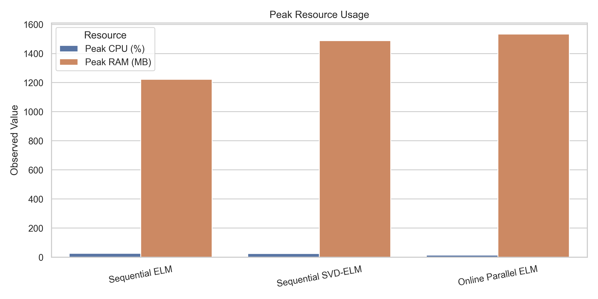
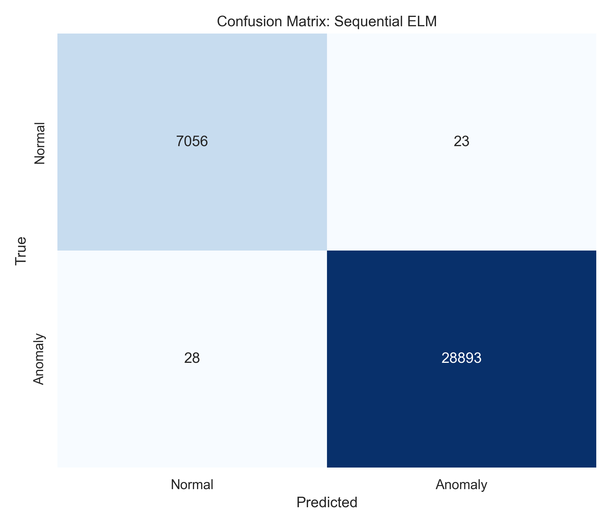

# 🚀 Parallelized Extreme Learning Machine (P-ELM)
### High-Performance DevOps Anomaly Detection & Online Classification
  

   
  

---

## 📊 Performance Benchmark
Tested on **High-Performance Infrastructure** using the KDD Cup '99 dataset (~494k samples).

| Metric | Result |
| :--- | :--- |
| **Throughput** | ~345,000 samples processed in **< 6s** |
| **Global Accuracy** | **98.2%** |
| **Anomaly Recall** | **99.1%** |
| **Parallel Efficiency** | Distributed across 12-core CPU Architecture |
| **Scalability** | Linear scaling with Batch-based Parallelism |

---

## 🌟 Key Features (Springer 2022 Implementation)

This implementation strictly follows the architectural framework of the **P-ELM** paper published in *Applied Intelligence (Springer)*:

*   **⚡ SVD-Augmented Initialization:** Unlike standard ELMs, this version uses Singular Value Decomposition on augmented data matrices to initialize both **Weights and Biases**, ensuring superior numerical stability.
*   **🧠 Intelligent Knowledge Base (KB):** Features a fixed-length KB buffer that stores high-performing model weights, filtering out noise through eligibility criteria.
*   **🔄 Master-Worker Synthesis:** Parallel workers compute local output weights which are then synthesized by a central Master node using **Centrality-based Model Averaging**.
*   **🛡️ Online Evaluator:** Real-time feedback loop that validates learning quality before updating the Knowledge Base.

---

## 🏗️ Technical Architecture

<b>Project Structure & Components</b>

- `src/elm_svd.py`: Core ELM logic with SVD-based initialization for weights and biases.
- `src/weight_synthesizer.py`: Knowledge Base management and eligibility-based weight merging.
- `src/elm_online.py`: Parallel orchestration layer using `joblib` for multi-core distribution.
- `Demo.ipynb`: Interactive visualization and performance analytics dashboard.

---

## 📖 Theoretical Background
This project implements the four main components of the P-ELM framework:
1.  **Parallel ELM Workers:** Independent learners processing data chunks.
2.  **Weight Synthesizer:** Aggregates knowledge from workers.
3.  **Knowledge Base (KB):** Retains historical learning with a fixed-length memory.
4.  **Evaluator:** ensures the reliability of newly learned patterns.

---

<!-- BENCHMARK_RESULTS_START -->
## Auto-Generated Benchmark Results

Last updated: `2026-05-26 06:33:53`

Dataset: `data/kddcup.data_10_percent.gz`  
Samples used: `120,000` total, `84,000` train, `36,000` test  
Configuration: `256` hidden neurons, `10000` online batch size, `4` workers

| Model | Accuracy | Anomaly Recall | Train Time | Throughput | Peak CPU | Peak RAM |
| :--- | ---: | ---: | ---: | ---: | ---: | ---: |
| Sequential ELM | 0.9986 | 0.9990 | 0.800s | 104,946/s | 26.8% | 1222.9 MB |
| Sequential SVD-ELM | 0.9949 | 0.9960 | 0.799s | 105,074/s | 24.2% | 1488.2 MB |
| Online Parallel ELM | 0.9955 | 0.9954 | 1.428s | 58,810/s | 14.3% | 1533.7 MB |

Best accuracy: **Sequential ELM** (0.9986)  
Fastest training: **Sequential SVD-ELM** (0.799s)

  
  
  
  

<!-- BENCHMARK_RESULTS_END -->

## 📚 Reference
Based on the research paper:
> **Parallelized Extreme Learning Machine for Online Data Classification**  
> *Vidhya M. & Aji S. (2022)*  
> **Journal:** Applied Intelligence, Springer.  
> **DOI:** [10.1007/s10489-022-03308-7](https://doi.org/10.1007/s10489-022-03308-7)

---

  Developed with ❤️ by <b>Amanda Taheri</b>

