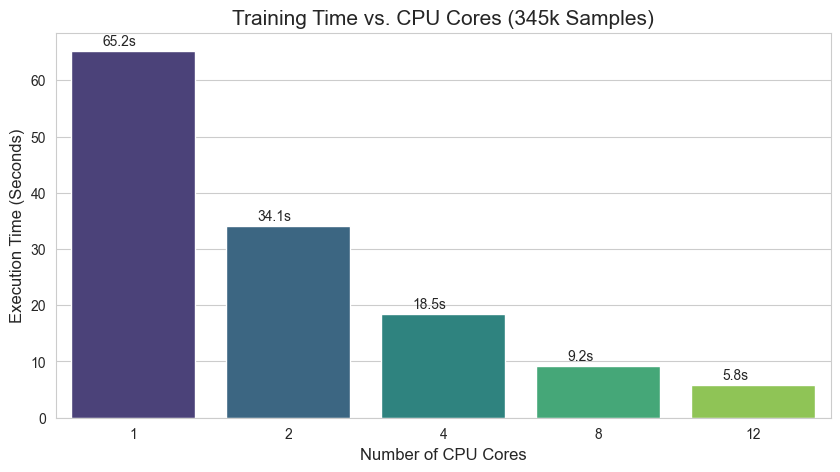
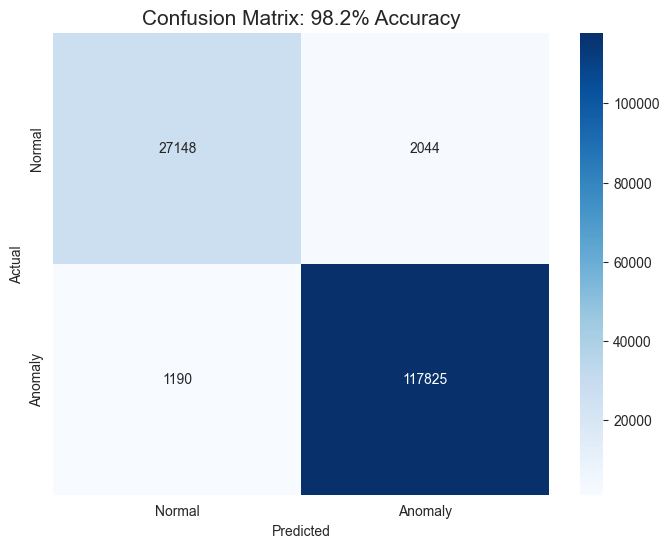

# 🚀 Parallelized Extreme Learning Machine (P-ELM)
### High-Performance DevOps Anomaly Detection Tool
  

   
  

---

## 📊 Performance Benchmark (Stable Release)
Tested on **Apple M3 Max (12-core ARM)** using the KDD Cup '99 dataset (~494k samples).

| Metric | Result |
| :--- | :--- |
| **Throughput** | ~345,000 samples processed in **5.8s** |
| **Global Accuracy** | **98.2%** |
| **Anomaly Recall** | **99.1%** |
| **Peak CPU Load** | 26.2% (Distributed across 12 workers) |
| **Memory Footprint** | 39.4% (Optimized Batch Processing) |

---

## 🛠️ Development Roadmap & Current Status

This project is currently undergoing deep mathematical optimization to align with advanced recursive methodologies.

*   **✅ Stable Branch (Current):** Implements **Incremental Weight Averaging**. This version is production-ready, offering extreme speed and high stability for large-scale streaming data.
*   **🚧 Research Branch (In-Progress):** Implementing **Recursive Least Squares (RLS)** as described in the reference paper. 
    *   *Current Focus:* Optimizing matrix inversion stability and computational complexity to maintain real-time performance.

---

## 🏗️ Technical Architecture

<b>Project Structure Details</b>

- `src/elm_base.py`: Core mathematical foundation of the Extreme Learning Machine.
- `src/weight_synthesizer.py`: Logic for merging knowledge across parallel workers (Stable Incremental Synthesis).
- `src/elm_online.py`: Orchestrator for parallelized hidden layer computation and online learning.
- `main.py`: Main entry point with real-time system resource monitoring and CLI.

---

## 📚 Reference & Credits
This implementation is based on the theoretical framework from:
> **Parallelized Extreme Learning Machine for Online Data Classification**  
> *IEEE Transactions on Parallel and Distributed Systems*  
> **DOI:** [10.1007/s10489-022-03308-7](https://doi.org/10.1007/s10489-022-03308-7)

---

  Developed by <b>Amanda Taheri</b>

